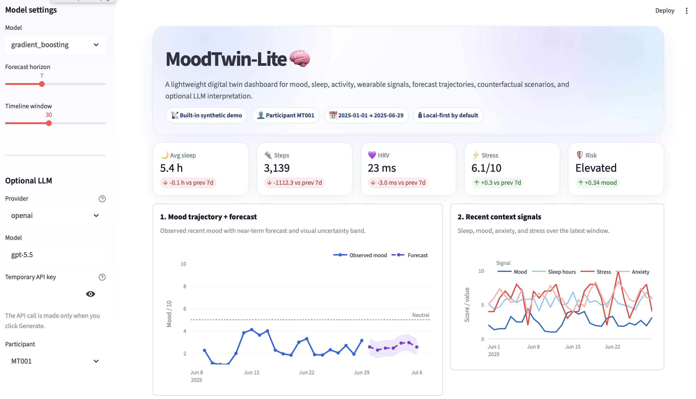
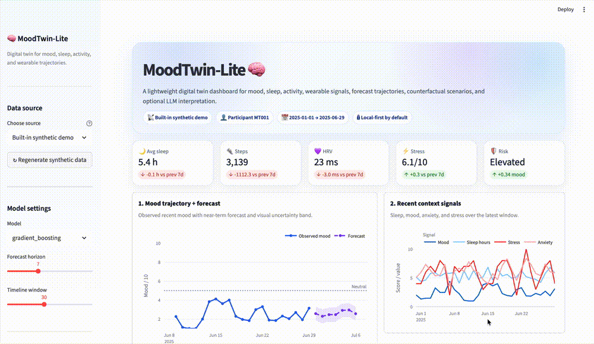
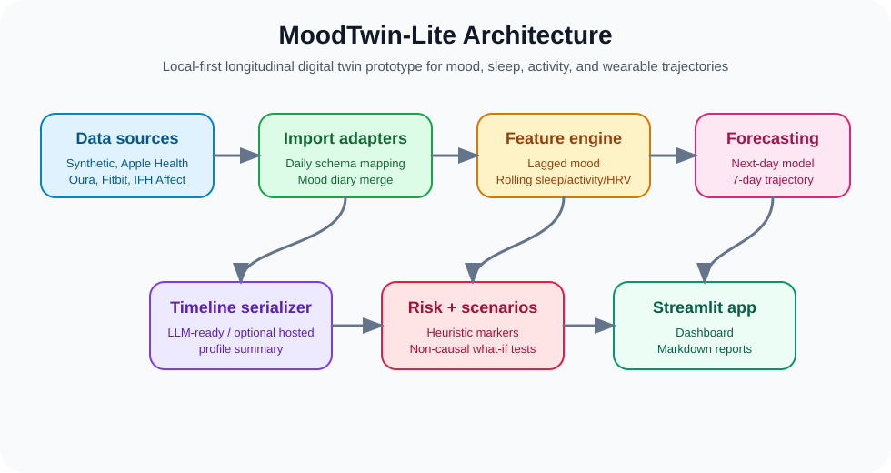

<h1 align="center">MoodTwin-Lite 🧠</h1>

<p align="center">
  <b>A lightweight digital twin for mood, sleep, and activity trajectories</b>
</p>


<p align="center">
  
  
  
  
  
</p>

MoodTwin-Lite is a lightweight longitudinal digital-twin prototype for **mood, sleep, activity, and wearable/smart-device trajectories**. It is inspired by the **timeline serialization** idea used in longitudinal patient digital-twin frameworks such as TwinWeaver, but it is an original, small, MacBook-friendly application. Instead of oncology EHR histories, it uses daily wearable and self-report style data: sleep, steps, active minutes, HRV, resting heart rate, screen time, stress, medication adherence, and self-reported mood.

> Educational/research prototype only. Not a medical device. Not for diagnosis, treatment, crisis management, or clinical decision-making.

## App preview

<p align="center">
  
</p>

## Demo

<p align="center">
  
</p>


## Architecture

<p align="center">
  
</p>

## What the app does

- Generates synthetic wearable-style longitudinal data.
- Imports local wearable exports from Apple Health, Oura-like daily CSVs, and Fitbit-like CSV/JSON files.
- Includes realistic 90-120 day wearable-export samples, not just tiny format templates.
- Supports optional daily mood diary merge for personal data.
- Trains a simple baseline forecasting model for near-term mood trajectory.
- Serializes a person's recent history into an LLM-ready timeline prompt.
- Adds optional OpenAI/Gemini LLM interpretation for clearer participant-friendly and researcher-facing summaries.
- Shows a polished single-page dashboard with compact cards, charts, risk summary, counterfactuals, data-quality checks, and LLM/local interpretation on the main page.
- Shows 7-day mood forecast and deterioration-risk markers.
- Runs counterfactual scenarios such as better sleep, more activity, and less late screen time.
- Exports a Markdown digital-twin report.


## Quick start on Mac

### 1. Check Python

```bash
python3 --version
```

Use Python 3.10 or newer if possible.

### 2. Create and activate a virtual environment

```bash
cd moodtwin-lite
python3 -m venv .venv
source .venv/bin/activate
```

### 3. Install dependencies

```bash
python -m pip install --upgrade pip
pip install -r requirements.txt
```

### 4. Generate synthetic data

```bash
python scripts/generate_data.py
```

This creates:

```text
data/synthetic_moodtwin_profiles.csv
```

### 5. Run the app

```bash
streamlit run app.py
```

A browser window should open automatically. If not, copy the local URL shown in the terminal.

### 6. Run tests

```bash
pytest
```

## Optional LLM interpretation

MoodTwin-Lite runs without API keys. By default, the app uses a deterministic local explanation. To add hosted LLM summaries, copy `.env.example` to `.env` and configure one provider:

```bash
cp .env.example .env
```

Open `.env` and choose one option.

OpenAI example:

```text
LLM_PROVIDER=openai
OPENAI_API_KEY=your_key_here
OPENAI_MODEL=gpt-5.5
```

Gemini example:

```text
LLM_PROVIDER=gemini
GEMINI_API_KEY=your_key_here
GEMINI_MODEL=gemini-3.5-flash
```

Then run the app and open the **LLM interpretation** tab. The API call is made only when you click **Generate LLM interpretation**.

The LLM receives the serialized timeline, model forecast, risk markers, counterfactual table, and model metrics. It does not replace the forecasting model. It only generates a clearer narrative interpretation.

See `docs/LLM_GUIDE.md` for privacy and setup details.

## Supported input sources

### 1. Built-in synthetic data

Use this first to verify everything works.

### 2. Realistic sample exports

Use these from the Streamlit sidebar to test the import workflow without needing your own wearable device:

```text
examples/oura_daily_120d_sample.csv
examples/fitbit_daily_120d_sample.csv
examples/apple_health_90d_sample.xml
examples/mood_diary_120d_sample.csv
```

The older 1-3 row files, such as `oura_daily_sample.csv`, are intentionally kept only as minimal format templates. They are not suitable for trajectory forecasting.

You can regenerate the realistic examples with:

```bash
python scripts/generate_demo_exports.py
```

### 3. MoodTwin schema CSV

Expected columns:

```text
participant_id,date,age,sex,baseline_risk_group,
sleep_hours,sleep_efficiency,sleep_midpoint_hour,
steps,active_minutes,resting_hr,hrv_rmssd,
screen_minutes,late_screen_minutes,social_minutes,
work_stress,medication_adherence,
mood_score,anxiety_score,energy_score,notes
```

### 4. Apple Health export.xml

The Apple Health adapter parses common HealthKit `Record` entries and creates daily summaries for:

- step count,
- sleep intervals,
- resting heart rate,
- HRV.

Example:

```bash
python scripts/convert_wearable_export.py \
  --source apple \
  --input examples/apple_health_90d_sample.xml \
  --mood-diary examples/mood_diary_120d_sample.csv \
  --output data/my_apple_moodtwin.csv
```

Note: Apple Health often represents HRV as SDNN; MoodTwin stores it in the shared `hrv_rmssd` slot for simplicity and records this in the notes.

### 5. Oura-like daily CSV

The Oura adapter accepts daily CSV columns such as:

```text
day,steps,total_sleep_duration,efficiency,average_hrv,lowest_resting_heart_rate,readiness_score,activity_score
```

Example:

```bash
python scripts/convert_wearable_export.py \
  --source oura \
  --input examples/oura_daily_120d_sample.csv \
  --mood-diary examples/mood_diary_120d_sample.csv \
  --output data/my_oura_moodtwin.csv
```

### 6. Fitbit-like daily CSV/JSON

The Fitbit adapter accepts CSV columns such as:

```text
dateTime,steps,minutesAsleep,efficiency,restingHeartRate,sedentaryMinutes,veryActiveMinutes
```

It also supports simple local JSON arrays and selected Fitbit Web API-style fragments.

Example:

```bash
python scripts/convert_wearable_export.py \
  --source fitbit \
  --input examples/fitbit_daily_120d_sample.csv \
  --mood-diary examples/mood_diary_120d_sample.csv \
  --output data/my_fitbit_moodtwin.csv
```


The adapter maps:

- daily EMA positive/negative affect → demo mood/anxiety/energy proxies,
- Oura activity → steps and active minutes,
- Oura sleep → sleep hours and sleep efficiency,
- Oura readiness → HRV/resting-heart-rate-like fields when available.

The generated mood score is **not a clinical diagnosis label**. It is a portfolio/demo target derived from daily affect balance.

## Personal data workflow

For a useful personal digital-twin demo, use wearable export + daily mood diary:

```text
date,mood_score,anxiety_score,energy_score,work_stress,medication_adherence,notes
2026-01-01,6,4,6,5,1,normal day
2026-01-02,5,5,5,6,1,short sleep and deadline
```

A sensor-only export can be displayed, but supervised mood forecasting requires repeated days with both sensor features and mood labels. As a practical minimum for this prototype, aim for 50-90 daily rows; 1-3 rows are only useful for validating file format parsing.

## How this differs from TwinWeaver

TwinWeaver serializes structured longitudinal clinical histories into text for LLM-based forecasting and event prediction. MoodTwin-Lite applies a similar design pattern to daily mood, sleep, activity, HRV, and wearable-style data, but it does not copy TwinWeaver code and does not require a GPU or clinical data access.

## Suggested GitHub description

> A local-first longitudinal digital twin prototype for forecasting mood trajectories from wearable, smart-device, and public digital-phenotyping data, with timeline serialization and counterfactual explanations.

## Repository structure

```text
moodtwin-lite/
  app.py
  requirements.txt
  README.md
  data/
    synthetic_moodtwin_profiles.csv
  docs/
    moodtwin_architecture.svg
    DATASET_CARD.md
    IMPORT_GUIDE.md
    MODEL_CARD.md
    LLM_GUIDE.md
  examples/
    apple_health_sample.xml               # tiny format template
    fitbit_daily_sample.csv                # tiny format template
    oura_daily_sample.csv                  # tiny format template
    mood_diary_template.csv                # tiny format template
    apple_health_90d_sample.xml            # realistic app demo
    fitbit_daily_120d_sample.csv           # realistic app demo
    mood_diary_120d_sample.csv             # realistic app demo
    oura_daily_120d_sample.csv             # realistic app demo
  scripts/
    adapt_ifh_affect.py
    convert_wearable_export.py
    generate_data.py
    generate_demo_exports.py
  src/
    importers.py
    public_datasets.py
    synthetic_data.py
    features.py
    model.py
    serializer.py
    risk.py
    counterfactuals.py
    llm_explainer.py
    report.py
    schemas.py
  tests/
```

## Responsible-use notes

- This is a research and portfolio prototype.
- Do not use it for diagnosis, treatment decisions, or safety-critical monitoring.
- Avoid uploading identifiable health data to public demos.
- Keep personal exports local.
- Use hosted LLM providers only with synthetic, public de-identified, or consented personal data.
- For GitHub screenshots, use synthetic or public de-identified data only.
